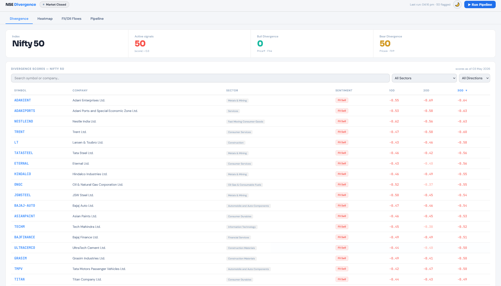
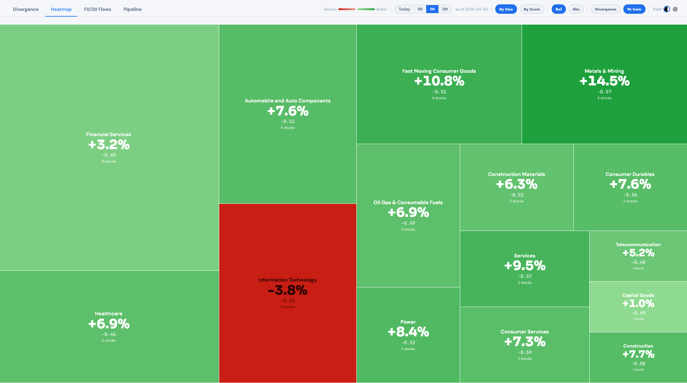
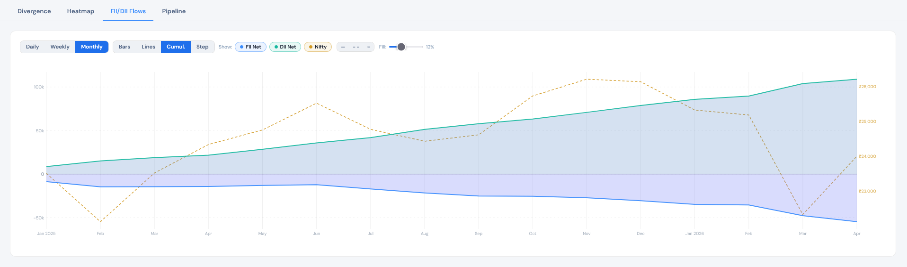

# StockFlow Analysis

A personal market intelligence dashboard for NSE Nifty 50. Tracks institutional flow, sector momentum, and price divergence in one place. No paid APIs, no framework overhead.

## What it does

- **Sector heatmap** — % gain/loss by sector across multiple timeframes
- **FII vs DII flow** — institutional buying/selling over time, charted
- **Divergence scores** — flags stocks where price movement diverges from broad institutional flow

## Stack

- **FastAPI** — serves the dashboard and API endpoints
- **PostgreSQL** — stores flow data, prices, divergence scores. The guide uses Supabase but any PostgreSQL instance works — just point `DATABASE_URL` in `.env` at your DB
- **Vanilla JS** — dashboard, no framework

## Data Sources

- **yfinance** — price data for Nifty 50 stocks. Personal use only
- **NSEPython** — FII/DII flow data scraped from NSE. Unofficial
- An unofficial API for historical FII/DII data — works as of v1, no guarantees

## Setup

1. Clone the repo
2. Create a virtual environment and install dependencies

```
   python -m venv venv
   venv/scripts/activate      # Windows
   source venv/bin/activate   # macOS/Linux
   pip install -r requirements.txt
```

4. Create a `.env` file in the project root

```
   DATABASE_URL=postgresql://your-connection-string-here
  
```

5. Run `app/data/schema.sql` in your Supabase SQL editor or any PostgreSQL instance to create all five tables
6. Seed the Nifty 50 stock list: `python -m app.setup.seed_stocks`
7. Seed historical FII/DII data: `python -m app.setup.seed_flows`
8. Start the server: `uvicorn app.main:app --reload`
9. Open `http://localhost:8000/dashboard` (you can run the pipeline from the dashboard too)

## Caveats

- **Divergence score** — uses market-wide aggregate FII/DII data, one number for all of NSE every day. Not stock-level, not sector-level. Every stock gets the same institutional signal — only the price movement differs. Treat it as a broad directional indicator, not a precise buy/sell signal
- **Data sources** — unofficial APIs, not authorised data feeds. Use at your own discretion
- **Scope** — v1 covers Nifty 50 only


## Screenshots






